## 멀티 모듈 프로젝트 구성

### 1. 구성

- internal-api -> core 의존성
- external-api -> core 의존성

### 2. 프로젝트 생성

> Gradle, Java 1.8

- Root 프로젝트인 'multi-module' 의 src 제거
- 하위 프로젝트 관리 역할

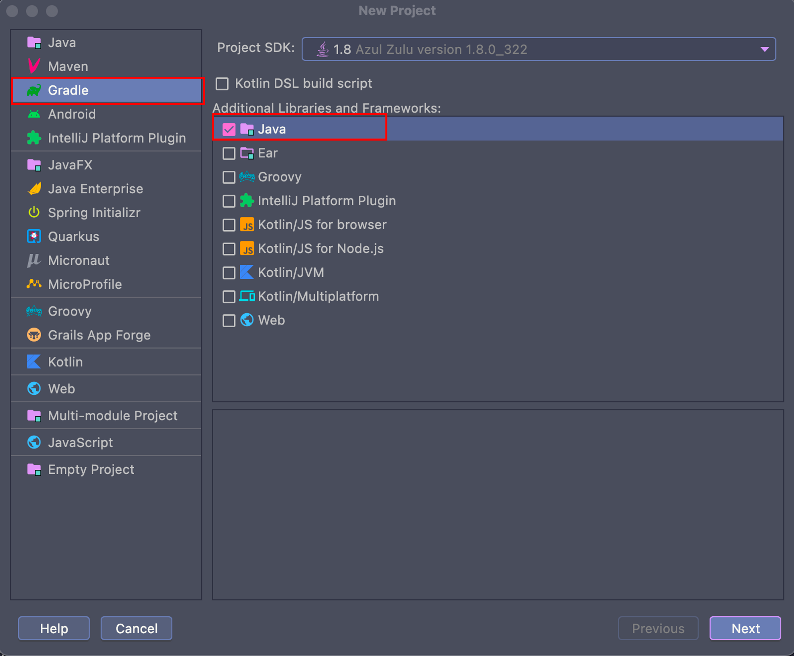
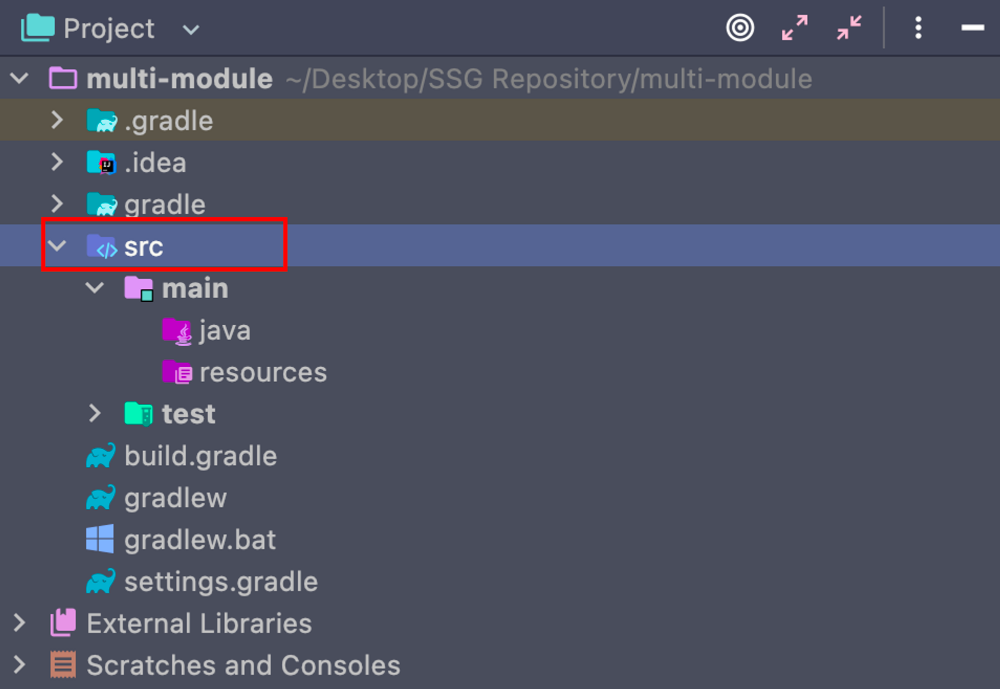

### 3. 모듈 추가

> 첫 번째 모듈 생성 (internal-api)

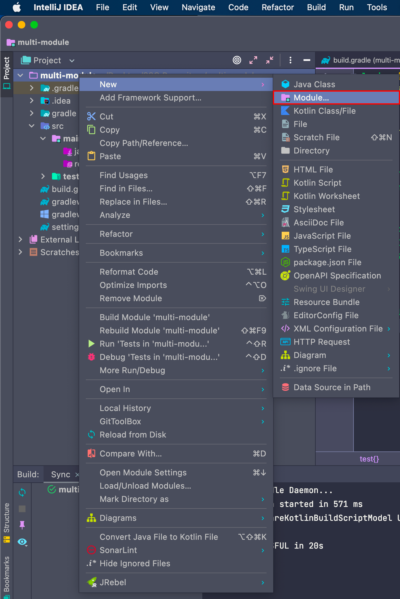
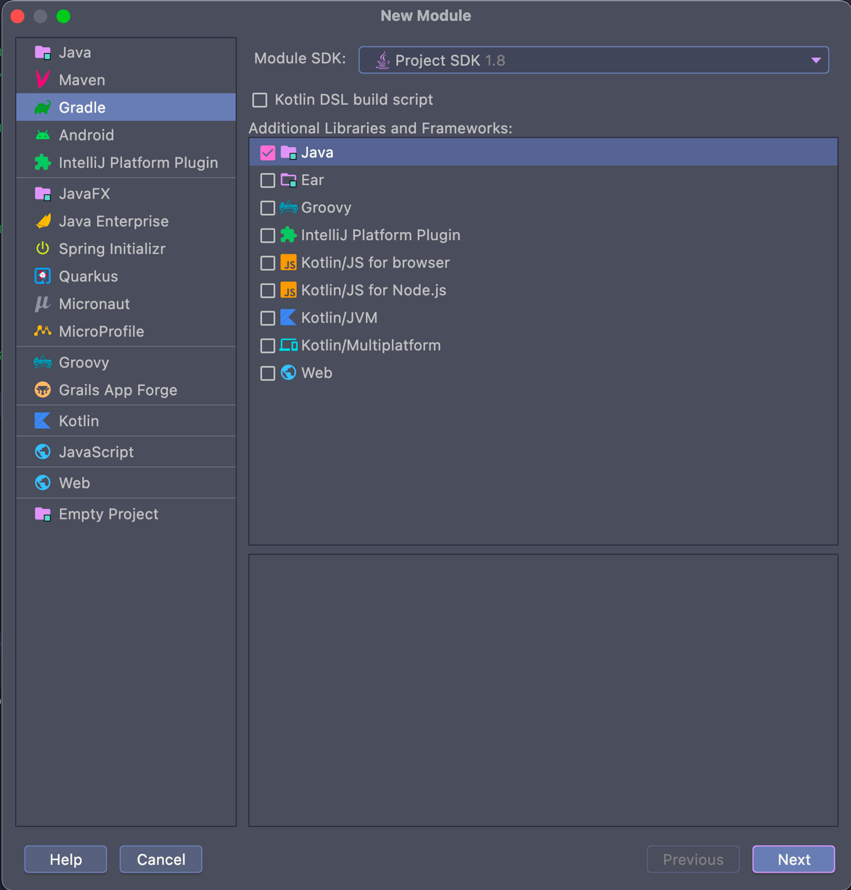
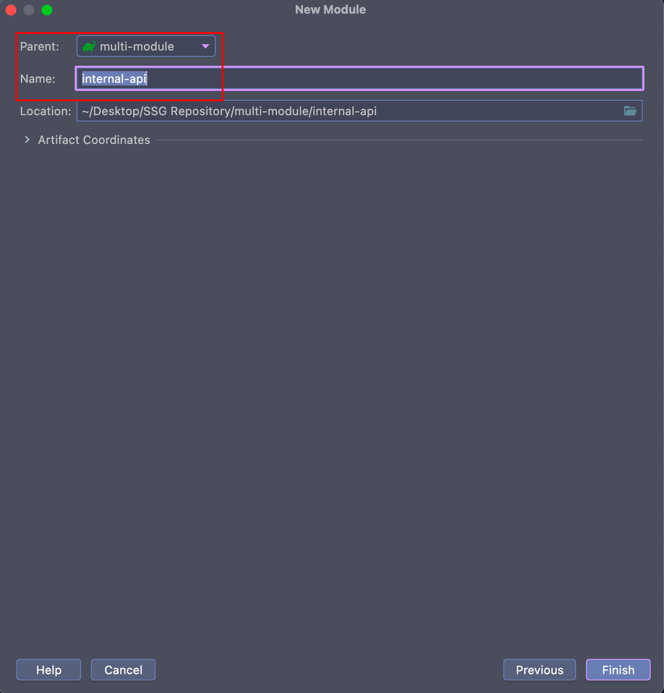

> 두 번째 모듈 생성 (external-api)

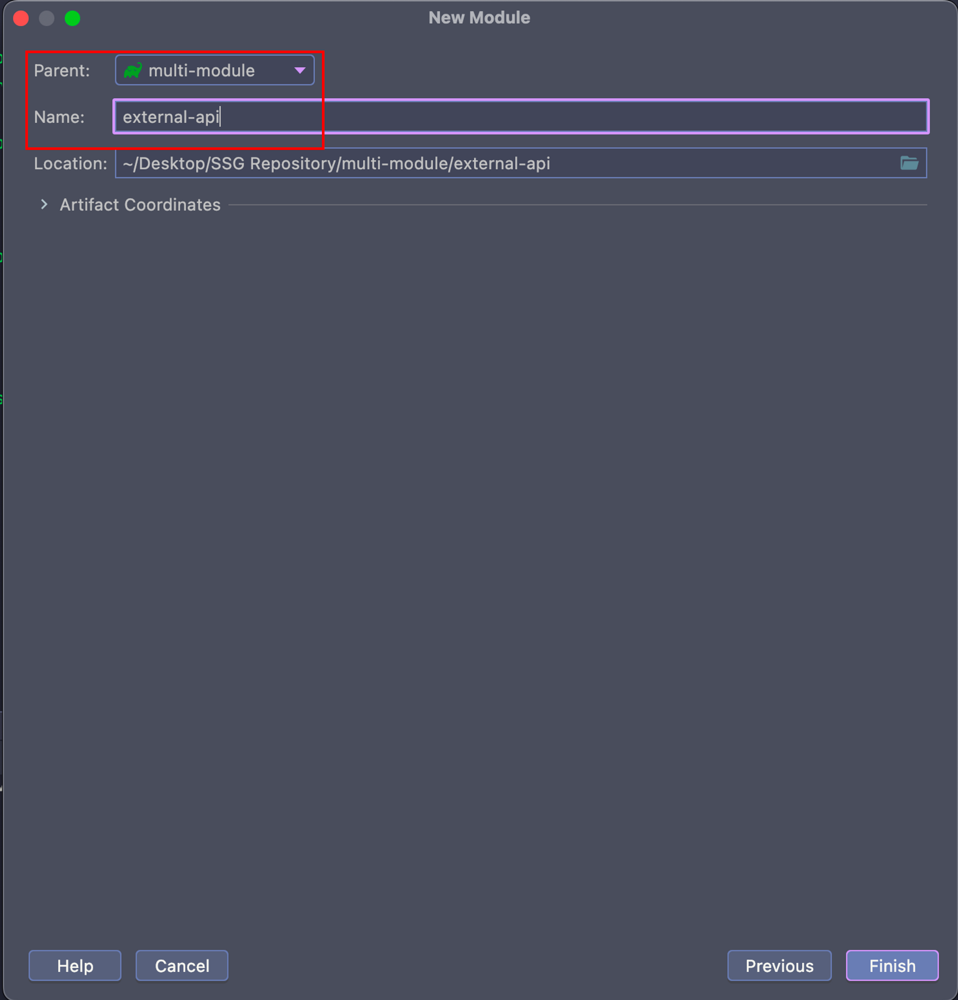

> 세 번째 모듈 생성 (core)

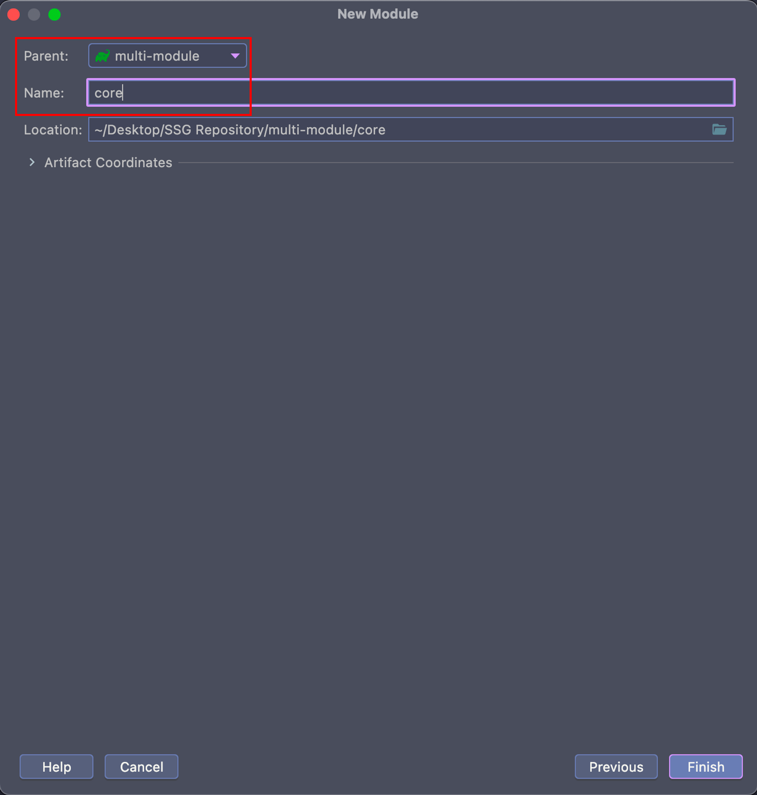

> internal-api, external-api, core 모듈 생성 최종

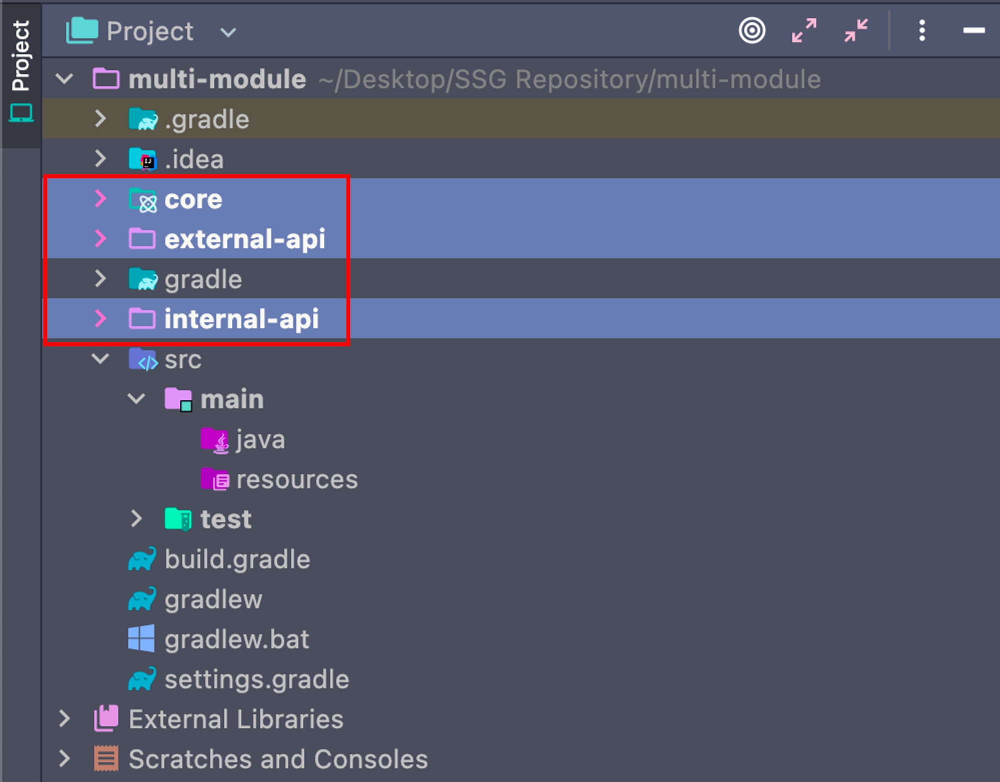

> settings.gradle 파일 확인

- 새로 추가된 모듈에 대해 인텔리제이가 자동으로 코드 추가

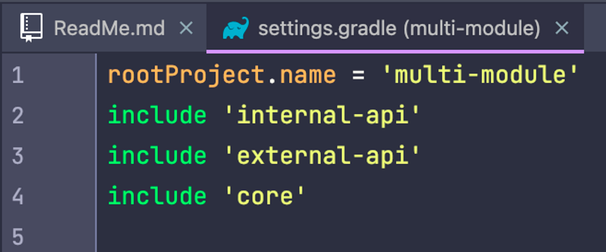

### 4. 프로젝트 셋팅

> build.gradle 설정

````gradle

buildscript {
    ext {
        springBootVersion = '2.6.2'
    }
    repositories {
        mavenCentral()
    }
    dependencies {
        classpath "org.springframework.boot:spring-boot-gradle-plugin:${springBootVersion}"
        classpath "io.spring.gradle:dependency-management-plugin:1.0.11.RELEASE"
    }
}

// 하위 프로젝트 공통 셋팅 (settings.gradle 파일 내 include 된 프로젝트)
subprojects {
    apply plugin: 'java'
    apply plugin: 'idea'
    apply plugin: 'org.springframework.boot'
    apply plugin: 'io.spring.dependency-management'

    group 'org.example'
    version '1.0-SNAPSHOT'

    sourceCompatibility = '1.8'
    targetCompatibility = '1.8'
    compileJava.options.encoding = 'UTF-8'

    repositories {
        mavenCentral()
    }

    // 하위 모듈에서 공통으로 사용하는 세팅 추가
    dependencies {
        compileOnly 'org.projectlombok:lombok'

        annotationProcessor 'org.projectlombok:lombok'
        annotationProcessor "org.springframework.boot:spring-boot-configuration-processor"

        testImplementation 'org.junit.jupiter:junit-jupiter-api:5.7.0'
        testRuntimeOnly 'org.junit.jupiter:junit-jupiter-engine:5.7.0'
    }

    test {
        useJUnitPlatform()
    }
}

// 하위 프로젝트 의존성 관리 (core 프로젝트 - 공통성)
project(':core') {
    bootJar { enabled = false } // core - bootJar 패키징 X
    jar { enabled = true }
}

// 하위 프로젝트 의존성 관리 (internal-api)
project(':internal-api') {
    bootJar { enabled = true }
    jar { enabled = false }

    dependencies {
        implementation project(':core') // 컴파일 시 core 프로젝트 로드
    }
}

// 하위 프로젝트 의존성 관리 (external-api)
project(':external-api') {
    bootJar { enabled = true }
    jar { enabled = false }

    dependencies {
        implementation project(':core') // 컴파일 시 core 프로젝트 로드
    }
}
````

> Reload All Gradle Projects

- internal-api, external-api 내 core 의존성 확인

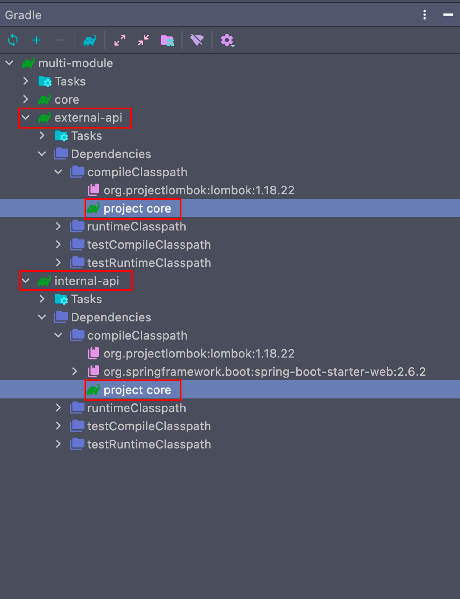

### 5. 모듈 설정

> [internal-api] build.gradle 설정

````gradle
dependencies {
    implementation 'org.springframework.boot:spring-boot-starter-web' // spring-boot-starter-web
    testImplementation 'org.junit.jupiter:junit-jupiter-api:5.8.1'
    testRuntimeOnly 'org.junit.jupiter:junit-jupiter-engine:5.8.1'
}
````

> [internal-api] resources > application.yml

````yml
server:
  port: 8089
````

> [internal-api] com.internal.sample

````java
package com.internal.sample;

import org.springframework.boot.SpringApplication;
import org.springframework.boot.autoconfigure.SpringBootApplication;

@SpringBootApplication
public class InternalApplication {
    public static void main(String[] args) {
        SpringApplication.run(InternalApplication.class, args);
    }
}
````

### 6. 공통 모듈 (core) 의존성 확인

> [core] com.positano.core.dto

````java
@Data
@Builder
public class SampleDto {
    private String name;
    private int age;
}
````

> [internal-api] com.internal.sample.controller

````java
package com.internal.sample.controller;

import org.springframework.web.bind.annotation.GetMapping;
import org.springframework.web.bind.annotation.RestController;

import com.positano.core.dto.SampleDto; // core 프로젝트 의존성 사용
import lombok.extern.slf4j.Slf4j;

@Slf4j
@RestController
public class InternalController {

    @GetMapping("/sample")
    public String sample() {
        SampleDto sampleDto = SampleDto.builder().name("Tom").age(30).build();
        log.info("core sampleDto - " + sampleDto.toString());

        return sampleDto.toString();
    }

}
````

> port 확인 및 end-point (localhost:8089/sample) 호출 로그 확인

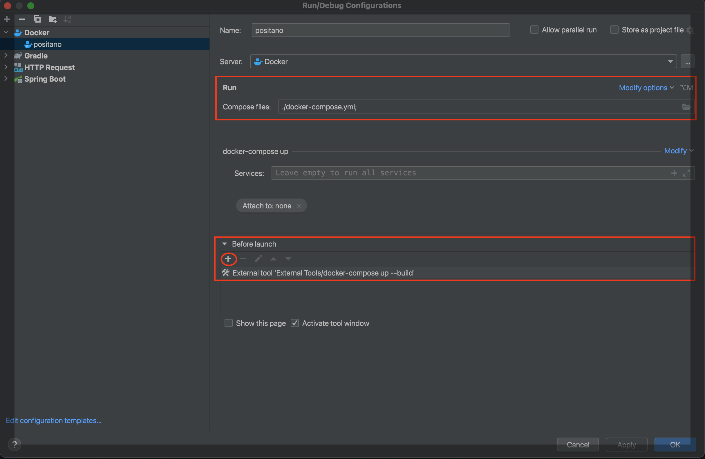


## Redis 연동

### 1. Docker - Redis 실행
> 실행 

````shell
docker run --name redis-container -d -p 6379:6379 redis
````

> 종료 

````shell
docker stop redis-container
````

> 재시작 

````shell
docker restart redis-container
````

> Redis에 비밀번호 설정이 필요한 경우

````shell
docker run --name redis-container -d -p 6379:6379 -e REDIS_PASSWORD=yourpassword redis
````

### 2. Docker - Redis 실행 확인
- Docker Desktop 실행 후 컨테이너 목록 확인
```shell
docker ps
```

### 3. Redis 의존성 추가 (build.gradle)
````shell
dependencies {
    implementation 'org.springframework.boot:spring-boot-starter-data-redis'
}
````

### 4. application.yml 설정
````yml
spring:
  redis:
    host: localhost
    port: 6379
````

### 5. Redis 연결 테스트
-  Redis 설정을 위한 RedisConfig 클래스 생성 (core 모듈)

````java
package com.positano.core.config.redis;

@Configuration
public class RedisConfig {

    @Bean
    public RedisTemplate<String, Object> redisTemplate(LettuceConnectionFactory redisConnectionFactory) {
        RedisTemplate<String, Object> template = new RedisTemplate<>();
        template.setConnectionFactory(redisConnectionFactory);
        template.setKeySerializer(new StringRedisSerializer());
        template.setValueSerializer(new GenericJackson2JsonRedisSerializer());
        return template;
    }
}
````

### 6. Redis - Service 생성 
````java
@Service
@RequiredArgsConstructor
public class RedisService {

    private final RedisTemplate<String, Object> redisTemplate;

    public void saveData(String key, Object value) {
        redisTemplate.opsForValue().set(key, value);
    }

    public Object getData(String key) {
        return redisTemplate.opsForValue().get(key);
    }
}
````

### 7. Controller에서 테스트

````java
/**
 * Redis - Sample Controller
 * @param key
 * @param value
 * @return
 */
@GetMapping("/set/{key}/{value}")
public String setRedisData(@PathVariable String key, @PathVariable String value) {
    internalService.setRedisData(key, value);
    return "Data saved!";
}

@GetMapping("/get/{key}")
public Object getRedisData(@PathVariable String key) {
    return internalService.getRedisData(key);
}
````

### 8. 실행 및 테스트
>  데이터 저장
````java
curl "http://localhost:8080/set/username/johndoe"
````

>  데이터 조회
````java
curl "http://localhost:8080/get/username"
````

## MongoDB 연동

### 1. Docker - MongoDB 실행
> 실행 

````shell
docker run --name mongodb -d -p 27017:27017 mongo:4.4 --noauth
````

> 종료
````shell
docker stop mongodb-container
````

> 재시작
````shell
docker restart mongodb-container
````

### 2. Docker - MongoDB 실행 확인
````shell
docker ps
````

### 3. Docker - MongoDB 접속 확인

````shell
docker exec -it mongodb mongo
````

### 4. MongoDB 의존성 추가 (build.gradle)

````gradle
dependencies {
    implementation 'org.springframework.boot:spring-boot-starter-data-mongodb'
}
````

### 5. application.yml 설정
````yml
spring:
  data:
    mongodb:
      uri: mongodb://localhost:27017/admin
````

## IntelliJ - docker-compose 실행 환경

> Docker 플러그인 설치

- Docker 플러그인 설치 (Preferences > Plugins)

> IntelliJ - Docker Compose 실행 설정

1. IntelliJ > Edit Configurations
2. 왼쪽 상단 + 버튼 클릭 및 `Docker-Compose` 선택
- 
3. Service 항목 > docker-compose.yml 파일이 있는 프로젝트 디렉터리를 선택
4. Before launch 항목 > + 버튼 클릭 후 `Run External Tool` 추가  
   - Name : `docker-compose up --build`
   - Program : `docker-compose`
   - Arguments: up --build
   - Working directory: 프로젝트의 루트 디렉토리 (docker-compose.yml 파일이 위치한 디렉토리)
   - 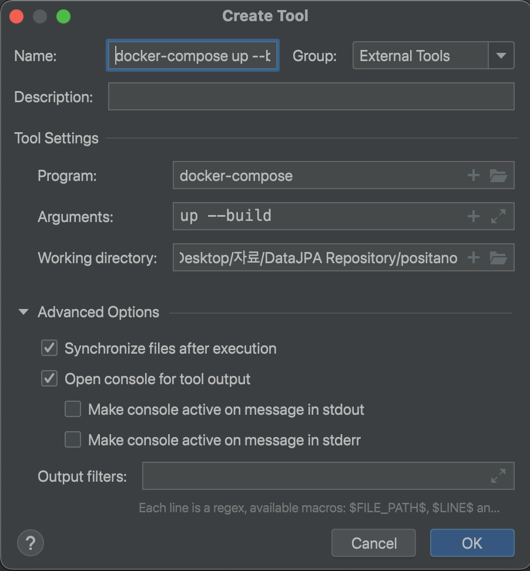
5. 실행
   - Run/Debug Configuration 에서 설정한 docker-compose up --build 설정 선택 후 상단의 실행 버튼(녹색 화살표)을 클릭하여 Docker Compose 서비스 시작
   - 또는 IntelliJ Terminal 에서 직접 `docker-compose up --build` 입력 후 실행